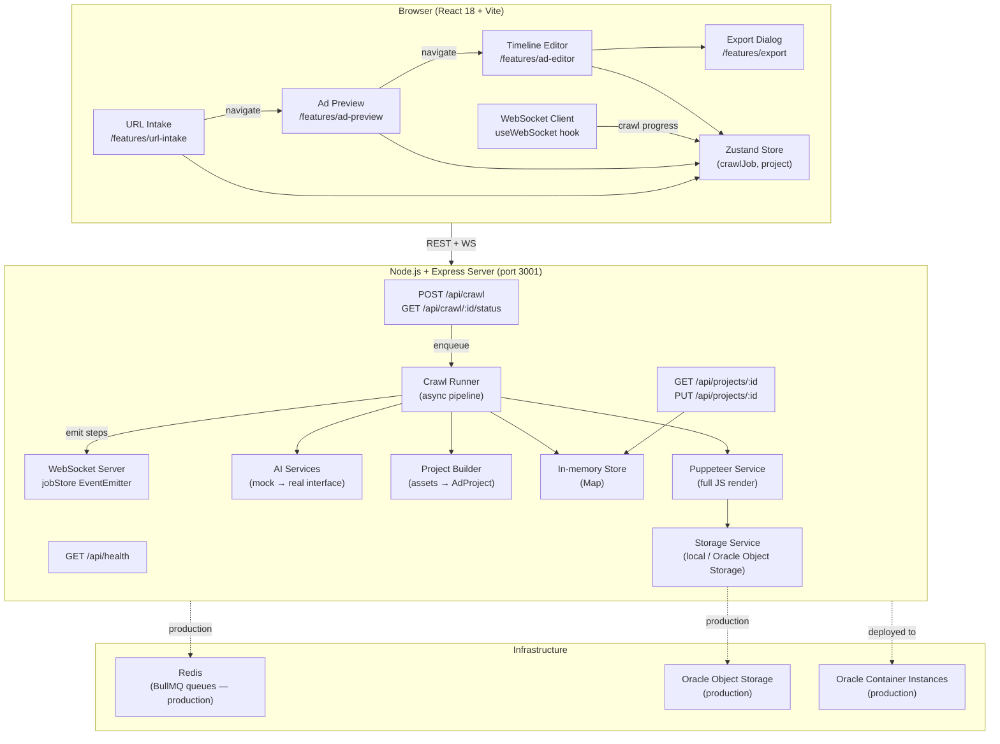

# Ad Studio

A production-quality AI ad creation tool. Paste a business URL → the system crawls it → generates a 30-second video ad concept → edit in the timeline → export.

---

## Architecture



---

## Quick Start (local, no Docker)

### Prerequisites

- Node.js 20+
- Chrome/Chromium (for Puppeteer crawling)

### 1 — Install dependencies

```bash
npm install
cd packages/server && npm install
cd ../client && npm install
```

### 2 — Configure environment

```bash
cp .env.example packages/server/.env
# No changes needed for local dev — defaults use mock AI and local storage
```

### 3 — Start the server

```bash
cd packages/server
npm run dev
# Listening on http://localhost:3001
```

### 4 — Start the client (new terminal)

```bash
cd packages/client
npm run dev
# Vite dev server at http://localhost:5173
```

Open `http://localhost:5173` and paste any public business URL.

---

## Quick Start (Docker Compose)

```bash
cp .env.example .env
docker compose up --build
```

| Service | URL |
|---|---|
| Client | http://localhost:5173 |
| Server | http://localhost:3001 |
| Health check | http://localhost:3001/api/health |

---

## Repo Structure

```
ad-studio/
├── packages/
│   ├── client/                  # React 18 + TypeScript + Vite
│   │   └── src/
│   │       ├── app/             # Router, ErrorBoundary
│   │       ├── features/
│   │       │   ├── url-intake/  # URL form, crawl progress page
│   │       │   ├── ad-preview/  # Canvas player, brand sidebar
│   │       │   ├── ad-editor/   # Timeline, properties panel
│   │       │   └── export/      # Format/resolution dialog
│   │       └── shared/
│   │           ├── components/  # Button, Input, Modal, Badge, Skeleton, Spinner, StepProgress
│   │           ├── hooks/       # useWebSocket, useCrawlProgress, useAdProject
│   │           ├── lib/         # apiClient, Zustand store
│   │           └── types/       # Full domain type mirror
│   └── server/                  # Node.js + Express + TypeScript
│       └── src/
│           ├── api/
│           │   ├── middleware/  # errorHandler, validate
│           │   └── routes/      # crawl.ts, projects.ts
│           ├── jobs/            # crawlRunner, jobStore, wsServer
│           ├── services/
│           │   ├── crawler/     # Puppeteer-based asset extractor
│           │   ├── ai/          # Mock + interface (OpenAI, ElevenLabs, fal.ai)
│           │   ├── media/       # FFmpeg composition stub
│           │   ├── projects/    # Project builder + in-memory store
│           │   └── storage/     # Local + Oracle Object Storage interface
│           ├── config/          # env.ts, logger.ts (Winston)
│           └── types/           # crawl.ts, project.ts domain types
├── infrastructure/
│   ├── oracle/                  # Terraform stubs for OCI Container Instances
│   └── docker/
├── docker-compose.yml
└── .env.example
```

---

## User Flow

```
1. Paste URL         →  POST /api/crawl (202 + jobId)
2. Progress screen   →  WebSocket subscribe :jobId
                        Steps: connecting → extracting_assets →
                               generating_concept → building_project
3. Ad Preview        →  Canvas slideshow of brand images + text overlays
                        Review voiceover script, brand colors, contact info
                        "Regenerate" modal to adjust tone/length
4. Timeline Editor   →  Drag clips, edit text, adjust volumes, set in/out points
                        30-level undo/redo
                        Save → PUT /api/projects/:id
5. Export            →  Choose resolution (1920×1080 / 1080×1920 / 1080×1080)
                        Format (MP4 / WebM), Frame rate (30 / 60 fps)
                        Mock compositing loop with SVG progress ring
                        Download link on completion
```

---

## Feature Flags

Set in `packages/server/.env`:

| Flag | Default | Effect |
|---|---|---|
| `FEATURE_REAL_AI` | `false` | Switch from mock to real OpenAI/ElevenLabs/fal.ai |
| `FEATURE_FFMPEG_EXPORT` | `false` | Enable real FFmpeg video composition on export |

---

## Tech Stack

| Concern | Choice | Why |
|---|---|---|
| Frontend | React 18 + Vite | Hooks, concurrent features, ESM-native HMR |
| State | Zustand | No Provider wrapping, hooks-native |
| Styling | CSS Modules + design tokens | Scoped, no utility class soup |
| Backend | Node.js + Express | FFmpeg bindings, Puppeteer, stream support |
| Crawling | Puppeteer | Full JS rendering, asset extraction |
| Jobs | BullMQ + Redis (production) | Reliable queues; fire-and-forget async in dev |
| Video | FFmpeg (server) + Canvas (client) | Server for export, canvas for real-time preview |
| Storage | Interface pattern | Swap local → Oracle Object Storage without changing callers |
| WebSockets | `ws` library | Real-time crawl progress |
| Logging | Winston | Structured logs, never `console.log` |

---

## API Reference

### `POST /api/crawl`
```json
{ "url": "https://example.com" }
```
Response `202`:
```json
{ "jobId": "uuid", "status": "pending" }
```

### `GET /api/crawl/:id/status`
```json
{
  "id": "uuid",
  "url": "https://example.com",
  "status": "complete",
  "projectId": "uuid",
  "steps": {
    "connecting":          { "status": "complete", "completedAt": 1713600000000 },
    "extracting_assets":   { "status": "complete", "completedAt": 1713600003000 },
    "generating_concept":  { "status": "complete", "completedAt": 1713600006000 },
    "building_project":    { "status": "complete", "completedAt": 1713600007000 }
  }
}
```

### `GET /api/projects/:id`
Returns full `AdProject` document.

### `PUT /api/projects/:id`
Accepts partial `AdProject` fields. Returns updated document.

### WebSocket — `ws://localhost:3001`

**Client → Server:**
```json
{ "type": "subscribe",   "jobId": "uuid" }
{ "type": "unsubscribe", "jobId": "uuid" }
{ "type": "ping" }
```

**Server → Client:**
```json
{ "type": "job_update",   "job": { ...CrawlJob } }
{ "type": "job_complete", "job": { ...CrawlJob } }
{ "type": "job_error",    "jobId": "uuid", "error": "message" }
{ "type": "pong" }
```

---

## Production Deployment (Oracle Cloud)

1. Provision OCI Container Instances via Terraform stubs in `infrastructure/oracle/`
2. Set `STORAGE_PROVIDER=oracle` and provide Oracle Object Storage credentials in environment
3. Set `FEATURE_REAL_AI=true` and provide API keys (OpenAI, ElevenLabs, fal.ai)
4. Redis is managed via Docker Compose or OCI Cache with Redis
5. Set `PUPPETEER_EXECUTABLE_PATH` to Chromium path inside the container image
